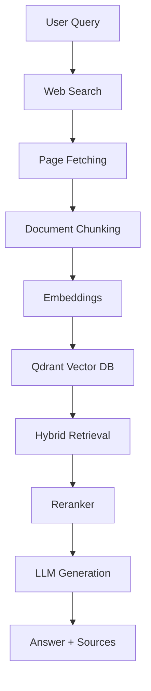

# Iterative Deep Research Engine

An AI-powered research system that performs web-scale information retrieval and generates grounded answers using a Retrieval-Augmented Generation (RAG) pipeline.

The system mimics modern research assistants (e.g., Perplexity-style systems) by combining real-time web search, document processing, vector retrieval, and LLM-based reasoning to produce source-backed answers.

---

# Overview

This project demonstrates how to build an end-to-end **AI research pipeline** that:

• retrieves real-time information from the web
• processes and indexes unstructured documents
• performs hybrid semantic + keyword retrieval
• reranks results for relevance
• generates grounded responses with citations

---

# Features

• Real-time web search integration
• Automatic webpage fetching and parsing
• Document chunking and embedding generation
• Vector storage using Qdrant
• Hybrid retrieval (semantic + keyword)
• Reranking for improved relevance
• Retrieval-Augmented Generation (RAG)
• Source-backed answer generation

---

# Architecture

The system follows a modular retrieval and generation pipeline:



---

# System Design

The pipeline is divided into clear functional components:

**Retrieval Layer**
Handles web search, document fetching, and indexing.

**Embedding Layer**
Converts text into vector representations using Sentence Transformers.

**Storage Layer**
Stores embeddings in Qdrant for efficient similarity search.

**Retrieval + Ranking Layer**
Combines semantic search with reranking to improve context quality.

**Generation Layer**
Uses LLMs to generate grounded answers based on retrieved context.

---

# Tech Stack

**Backend**

• Python
• FastAPI

**AI / ML**

• Sentence Transformers
• Retrieval-Augmented Generation (RAG)

**Database**

• Qdrant (vector database)

**LLM APIs**

• External LLM providers for generation

---

# Installation

```bash
git clone https://github.com/Dev048/iterative-deep-research-engine.git
cd iterative-deep-research-engine
pip install -r requirements.txt
```

Create environment file:

```bash
cp .env.example .env
```

Add your API keys to `.env`.

Run the server:

```bash
uvicorn backend.app.main:app --reload
```

---

# API Usage

### Endpoint

```http
POST /research
```

### Request

```json
{
  "query": "latest breakthroughs in robotics"
}
```

### Response

```json
{
  "answer": "...",
  "sources": ["url1", "url2"]
}
```

---

# Example

**Query**

```text
What are recent breakthroughs in robotics?
```

**Answer (Generated)**

Recent breakthroughs in robotics include advances in AI-driven control systems, humanoid robotics, and autonomous manipulation technologies.

**Sources**

* https://example-source-1.com
* https://example-source-2.com

---

# Project Structure

```
backend/
  app/
    api/
    retrieval/
    embeddings/
    rag/
    services/
    main.py

frontend/
tests/
docs/
examples/
assets/

README.md
requirements.txt
.env.example
```

---

# Future Improvements

• Iterative multi-step research loops
• Multi-agent research workflows
• Streaming responses
• Improved reranking models
• Long-term memory for research sessions
• Interactive UI

---

# License

This project is released under the MIT License.
